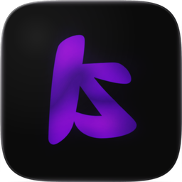

<div align="center">



# Kiza Launcher

**A Minecraft launcher that tells the truth.**

Isolated instances · mods from Modrinth and CurseForge in one search · a Kiza client drawn inside the game

Written in Rust for Windows · in active development

</div>

---

## What it is

Kiza manages Minecraft the way a launcher should: every instance keeps its own
mods, worlds and version, and nothing leaks into its neighbour. Mods come from
Modrinth and CurseForge through a single search. When the game stops, the crash
report names the mod rather than saying an error occurred.

It is not publicly downloadable yet.

## Layout

| | |
|---|---|
| `KizaaModEngine-Tauri/` | the launcher — Tauri, Rust backend, React interface |
| `KizaaModEngine-Tauri/kiza-base-mod/` | the in-game client, built for Fabric and three Forge generations |
| `KizaaModEngine-Tauri/kiza-setup/` | Kiza Setup — the installer, an application rather than a wizard |
| `KizaaModEngine-Tauri/cloudflare/` | the update service: a Worker serving signed releases from R2 |
| `.github/workflows/` | tests on every push, a signed release on every tag |

## Building

```bash
cd KizaaModEngine-Tauri
npm install
npm run tauri dev
```

A release needs `KIZAMODS_CURSEFORGE_API_KEY` and a signing key. It produces one
file — the installer carries the launcher inside it, so nothing is downloaded
during installation.

```bash
npm run build:installer
```

## Updates

Every release is signed at build time with a key that never leaves the release
machine, and checked against a public key compiled into the launcher. A
signature that does not verify is refused, not installed.

The launcher asks a Cloudflare Worker first and falls back to GitHub releases if
it does not answer.

## Support

Kiza is written by one person. No studio, no ads in the launcher, no paid
edition planned.

**[Support on Patreon](https://www.patreon.com/cw/nefcode)**

---

<div align="center">
<sub>Independent project. Not affiliated with Mojang, Microsoft, Modrinth or CurseForge.<br>
Minecraft is a trademark of Mojang Synergies AB.</sub>
</div>
